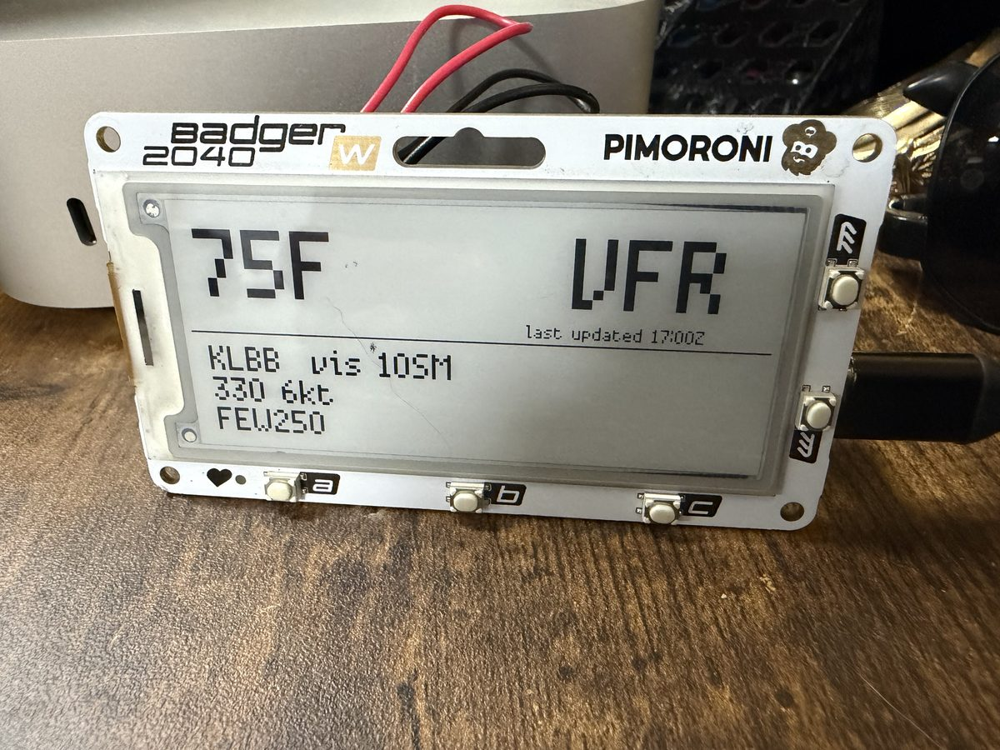

# SkyGlance

[](./LICENSE)
[](https://www.python.org/)
[](https://github.com/pimoroni/pimoroni-pico)
[](https://aviationweather.gov)

Desk-side aviation weather at a glance. SkyGlance turns a
[Pimoroni Badger 2040 W](https://shop.pimoroni.com/products/badger-2040-w)
into an always-on e-ink board that shows the current **METAR** for any
ICAO airport — temperature, flight category (`VFR` / `MVFR` / `IFR` / `LIFR`),
wind, visibility, cloud layers, and a 24-hour Zulu observation time.

The device talks directly to `aviationweather.gov` over HTTPS. **No server,
no API key, no account** — flash it, set your Wi-Fi SSID and an ICAO
identifier, and it runs.



## Display

```
 +------------------------------------------------+
 |                                                |
 |   86F                     VFR                  |
 |                                                |
 |                           last updated 22:00Z  |
 |  ----------------------------------------------|
 |   KLBB    vis 10SM    DA5600                   |
 |   200 5kt G15    86/46                         |
 |   FEW050                                       |
 +------------------------------------------------+
```

Lines 1-2: big temp (°F) + flight category; small `last updated` time
in Zulu. Line 3: station, visibility, density altitude. Line 4: wind
(direction / speed / gust) and temperature/dewpoint (°F). Line 5: cloud
layers in METAR short form.

The **DA** value is the current density altitude in feet, computed from
the station elevation + altimeter setting + observed temperature. It's
what your airplane thinks the air feels like for takeoff performance.
Press **B** for a full details page (altimeter, dewpoint, temp/dew
spread, DA + PA, plus the raw METAR text).

- Big temp (Fahrenheit) top-left.
- Big flight category top-right.
- Last observation time (UTC / Zulu) in the corner.
- Station, visibility, wind, cloud layers below.
- `(offline)` marker in the bottom-right if the last fetch failed; the
  previous frame stays on-screen until the next successful refresh.

## Quick start

### 1. Clone and install host dev tools

```bash
git clone https://github.com/gndl00p/skyglance.git
cd skyglance

python3 -m venv .venv
.venv/bin/pip install pytest==8.3.3

.venv/bin/pytest tests -v      # 24 tests, fully offline
```

### 2. Configure the device

```bash
cp config.example.py config.py
```

Edit `config.py`:

```python
WIFI_SSID = "your 2.4 GHz SSID"
WIFI_PSK  = "password"

# One or more ICAO airport identifiers. Press UP or DOWN on the badge
# to open the picker and switch between them; the first entry is the
# default on first boot.
METAR_STATIONS = ["KLBB", "KAUS", "KDFW", "EGLL"]

# How often to re-fetch the METAR for the currently-displayed station.
# aviationweather.gov updates hourly; 15 min is a polite cadence.
REFRESH_MINUTES = 15
```

`config.py` is git-ignored — your Wi-Fi password never leaves the device.

### 3. Flash

```bash
bash tools/flash.sh
```

The script copies `main.py`, `fetcher.py`, `render.py`, `store.py`, and
`config.py` to the Pico, preserves any persisted `/state.json`, and
triggers a soft-reset.

## How it works

```
  +------------------------+          HTTPS          +------------------------+
  |  aviationweather.gov   |<------------------------| Badger 2040 W          |
  |  /api/data/metar       |                         | MicroPython firmware   |
  +------------------------+                         | Wi-Fi + e-ink panel    |
                                                     +------------------------+
```

- `main.py` boots, runs one fetch + render cycle, then loops every
  `REFRESH_MINUTES`. Button **A** forces an immediate refresh.
- `fetcher.py` connects Wi-Fi, hits `aviationweather.gov` over HTTPS,
  and parses the METAR JSON into a flat dict (temp °F, wind, clouds,
  visibility, ceiling, flight category).
- `render.py` paints the e-ink panel.
- `store.py` persists the last successful fetch in `/state.json` so
  the panel has something to show during Wi-Fi or API outages.
- On any error the previous frame stays, a small `(offline)` / `(bad payload)` marker appears, and the next refresh tries again.

Stable at ~5 KB of flash for the application plus the persisted state
file. No extra dependencies beyond what Pimoroni's stock MicroPython
build already ships (`badger2040`, `requests`, `network`, `ujson`).

## Flight category thresholds

| Category | Ceiling        | Visibility (SM) |
| -------- | -------------- | --------------- |
| **LIFR** | < 500 ft       | < 1             |
| **IFR**  | < 1 000 ft     | < 3             |
| **MVFR** | ≤ 3 000 ft     | ≤ 5             |
| **VFR**  | > 3 000 ft     | > 5             |

Evaluated top-to-bottom — a 700 ft ceiling wins over 10 SM visibility.

## Configuration (`config.py`)

| Field              | Purpose                                                           |
| ------------------ | ----------------------------------------------------------------- |
| `WIFI_SSID`          | 2.4 GHz network the Pico W joins                                  |
| `WIFI_PSK`           | Pre-shared key                                                    |
| `METAR_STATIONS`     | List of ICAO identifiers, e.g. `["KLBB", "KAUS", "EGLL"]`         |
| `METAR_STATION`      | (legacy, single identifier) — used when `METAR_STATIONS` is unset |
| `REFRESH_MINUTES`    | How often to re-fetch. METARs update hourly — 15 is polite.       |
| `AUTO_CYCLE_MINUTES` | Rotate the displayed station every N minutes (0 disables).       |
| `TIMEZONE_OFFSET`    | Hours from UTC for the sunrise/sunset display (-5 = CDT, +1 = CET). |

## Buttons

### Main screen (weather)

| Button     | Action                                                     |
| ---------- | ---------------------------------------------------------- |
| A          | Force refresh the current station                          |
| B          | Show the **raw METAR** for the current observation         |
| C          | Open the **status** page (battery, Wi-Fi, station)         |
| UP, DOWN   | Open the **station picker**                                |

### Station picker

| Button     | Action                                                     |
| ---------- | ---------------------------------------------------------- |
| UP         | Move cursor up (wraps)                                     |
| DOWN       | Move cursor down (wraps)                                   |
| A          | Select the highlighted station; return to main screen      |
| B          | Cancel; return to main screen                              |

The selected station is persisted in `/state.json`, so a reboot comes
back to the last airport you chose.

The on-board LED briefly pulses every 20 seconds as a heartbeat, so
you can tell at a glance that the firmware is still running.

### Status page

| Button     | Action                                                     |
| ---------- | ---------------------------------------------------------- |
| A          | Refresh the status readings (battery, Wi-Fi, etc.)         |
| B          | Return to main screen                                      |

### Details page (raw METAR + derived values)

| Button     | Action                                                     |
| ---------- | ---------------------------------------------------------- |
| B          | Return to main screen                                      |

Shows altimeter setting (inHg), dewpoint (°F), temp/dew spread (°F),
density altitude, pressure altitude, and the raw METAR line straight
from `aviationweather.gov`.

## Repository layout

```
main.py            entry point — first cycle, then refresh loop
fetcher.py         Wi-Fi connect, HTTPS GET, METAR parser, stale fallback
render.py          e-ink layout
store.py           /state.json persistence (read/write)
config.example.py  template (copy to config.py, never committed)
tools/flash.sh     mpremote-based deploy + soft-reset

tests/             host-side pytest suite
  conftest.py        adds tests/stubs to sys.path
  stubs/             fake Pimoroni / MicroPython modules
  fakes/display.py   FakeDisplay that records draw calls
```

## Development

Run the suite:

```bash
.venv/bin/pytest tests -v
```

Everything is mocked — no real hardware, no network. The
`tests/stubs/` directory provides tiny fakes for `badger2040`,
`network`, `requests`, `machine`, and `ujson` so the modules that
import them at device boot still import cleanly on CPython.

To add a feature that calls a new Pimoroni API, extend the stub in
`tests/stubs/badger2040.py` with a no-op method — this keeps the
suite runnable on any machine without a device attached.

## Troubleshooting

### The panel shows `--F ----` indefinitely

Wi-Fi didn't connect. Verify SSID + PSK in `config.py`. Reset the
device; if the issue persists, run a scan:

```bash
mpremote connect /dev/ttyACM0 exec 'import network, time
w = network.WLAN(network.STA_IF); w.active(True); time.sleep(1)
for n in w.scan(): print(n[0], n[2], n[3])'
```

### Buttons don't respond after the first render

The firmware uses a polling idle loop specifically because
`display.halt()` on the Badger 2040 W is a no-op under USB power.
If buttons are still unresponsive, every `mpremote exec` ctrl-Cs
the running firmware — issue `mpremote connect /dev/ttyACM0 soft-reset`
to restart it.

### `ImportError: no module named 'state.load'`

The factory Pimoroni filesystem ships a `state/` directory for the
stock launcher; MicroPython resolves `import state` to that package
and shadows a `state.py` file. That's why the persistence module is
called `store.py` instead of `state.py`.

## Security notes

- `config.py` holds your Wi-Fi password and is git-ignored. Review
  `.gitignore` after any branch-switch rebase.
- The device only makes outbound HTTPS to `aviationweather.gov`. No
  inbound listeners, no telemetry, no analytics.
- Resetting the device via BOOTSEL + drag-drop the factory firmware
  clears everything; run `bash tools/flash.sh` to restore.

## Roadmap

- Optional second METAR tile (home / destination) with paged display.
- Battery-powered variant using `halt()` + `badger2040.pressed_to_wake`
  for multi-day LiPo runtime between refreshes.
- Visual alert when flight category degrades by two tiers in one cycle.
- Flash-minimising build (strip unused Pimoroni libs).

## License

MIT — see [LICENSE](./LICENSE).

## Acknowledgements

Hardware + MicroPython runtime from [Pimoroni](https://pimoroni.com).
METAR data from the [Aviation Weather Center](https://aviationweather.gov).
